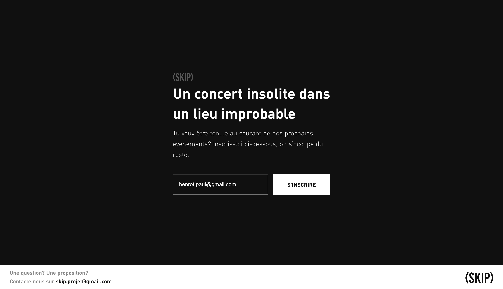
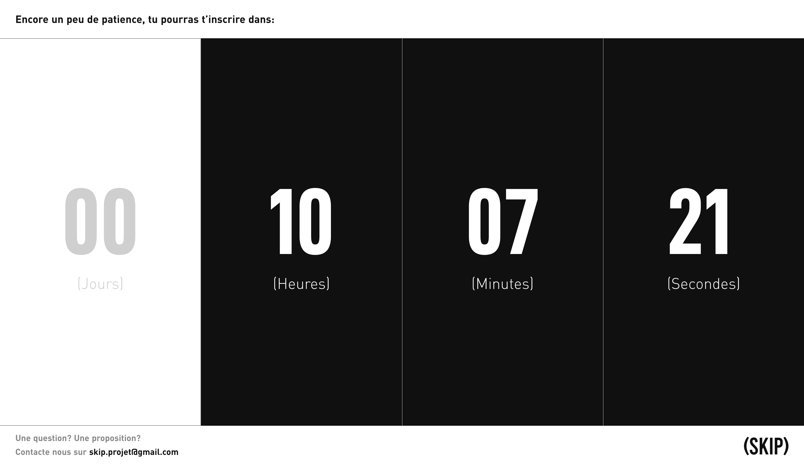
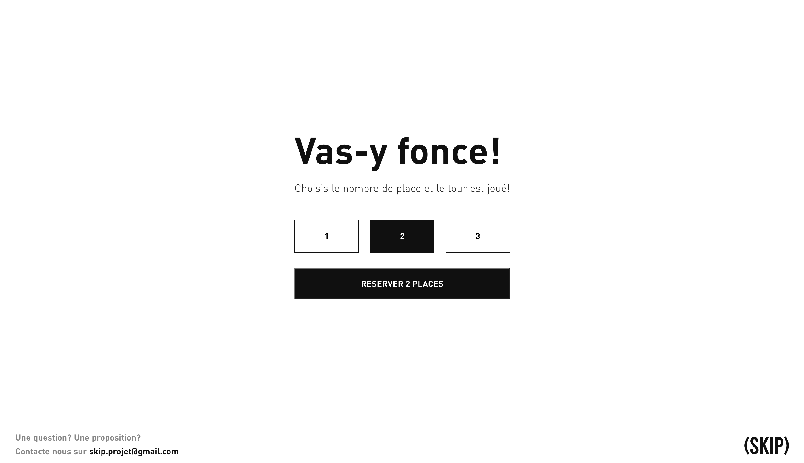
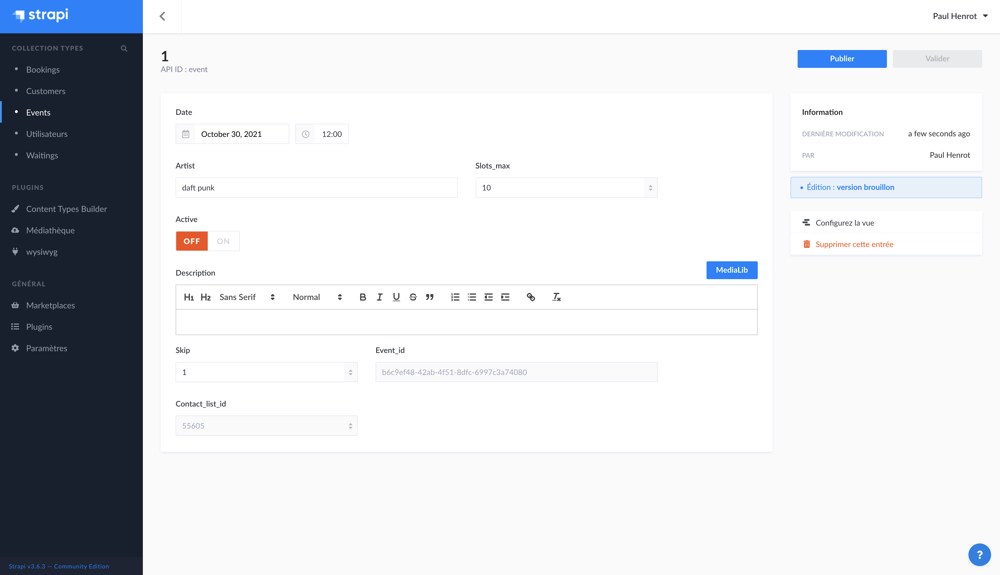
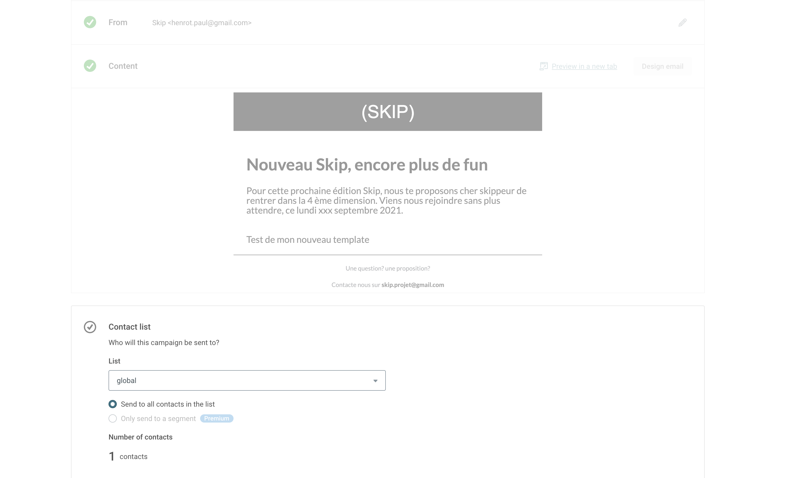

   

    <!--  -->
    <h1>SKIP PROJECT</h1>

 

 

 

**Features:**
Newsletter -
Concert Subscription -
CMS To manage events and users - 
Mailing Solution

 

    <video autoplay loop src="./images/video.mp4" height=200>&nbsp;&nbsp;

 
 

[live demo](https://skip-app-1984.netlify.app/)

_NB: The demo is a fork of the real project. All events are fake

 

# The client

SKIP is an ASBL who organize little concerts (40-100 persons) all around the city.
Subscribers to event know the band and the exact location only a few hours before the concert.

# The needs
Develop a solution to allow users to subscribe for a newsletter and register to a particular event.
The client need to manage their events and mail via a back office.

# Stack

NuxtJS - Hasura(graphql Database) - Strapi(CMS) - Netlify - Mailjet(Mailing management)

# some screenshots

    &nbsp;&nbsp;
    &nbsp;&nbsp;
    &nbsp;&nbsp;

    &nbsp;&nbsp;
    &nbsp;&nbsp;

